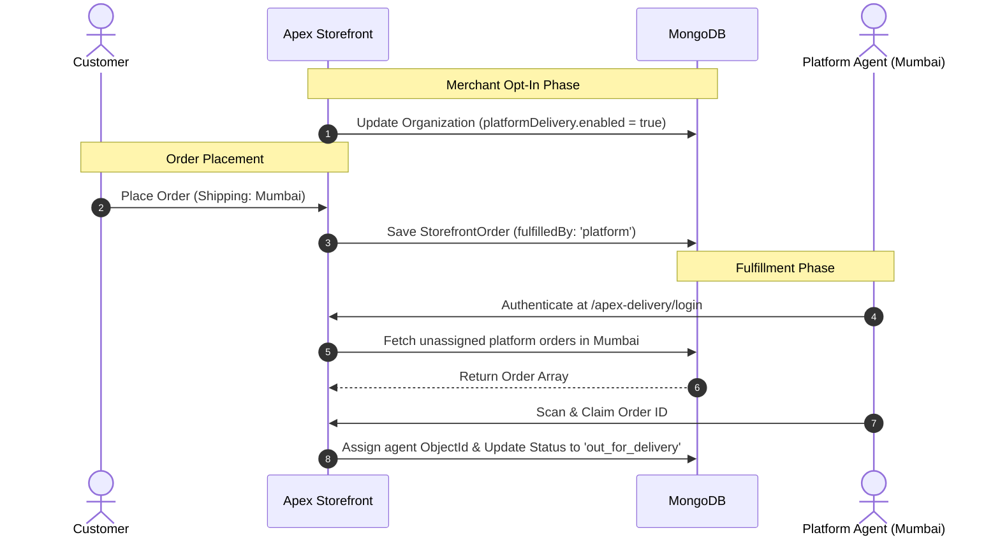

# Apex Global Delivery Network

> Enterprise-scale hybrid fulfillment ecosystem for the Apex Storefront platform.

The **Apex Global Delivery Network** is a distributed, location-based fulfillment architecture that bridges the gap between independent merchants and a shared pool of global freelance delivery partners. This documentation covers the architecture, data models, API reference, and developer workflow for the platform.

---

## Table of Contents

- [Introduction](#introduction)
- [Architecture Overview](#architecture-overview)
- [Database Schema (MongoDB)](#database-schema-mongodb)
- [API Reference](#api-reference)
- [Frontend Architecture (Angular)](#frontend-architecture-angular)
- [Developer Guide & Setup](#developer-guide--setup)

---

## Introduction

Historically, Apex Storefront merchants were required to onboard and manage their own delivery agents within their specific `organizationId`. The **Global Delivery Network** introduces a hybrid strategy:

1. **Merchant-Scoped Agents**: Private delivery fleet managed directly by the merchant.
2. **Platform-Scoped Agents**: A shared, global pool of freelance agents assigned to orders based on geographical proximity (City/State/Zip) rather than organizational hierarchy.

Merchants can opt-in to this global network via their Storefront Settings, allowing the platform to seamlessly route their orders to external delivery partners.

---

## Architecture Overview

The system employs a decentralized routing mechanism governed by the merchant's configuration preferences and the delivery partner's registered location.



---

## Database Schema (MongoDB)

### `PlatformDeliveryAgent` (New)
A globally-scoped entity unattached to any `organizationId`.
* **Authentication**: `email`, `password` (bcrypt hashed)
* **Demographics**: `name`, `phone`
* **Geospatial Boundaries**: `city`, `state`, `zipCode`
* **System Tokens**: Issues JWT with `type: 'platform_delivery_agent'`

### `Organization` (Modified)
* **`platformDelivery.enabled`** (`Boolean`): Defaults to `false`. Controls whether the merchant's orders are exposed to the global pool.

### `StorefrontOrder` (Modified)
* **`fulfilledBy`** (`Enum: ['merchant', 'platform']`): Tracks the routing decision at the time of checkout.
* **`platformDeliveryAgent`** (`ObjectId`): A reference to the `PlatformDeliveryAgent` who claimed the order.

---

## API Reference

Base Path: `/api/v1/platform-delivery`

### Authentication & Registration
* `POST /register`
  * **Payload**: `name`, `email`, `password`, `phone`, `city`, `state`, `zipCode`
  * **Response**: `201 Created`
* `POST /login`
  * **Payload**: `email`, `password`
  * **Response**: `200 OK` (Returns specialized JWT token)

### Order Management (Requires JWT Auth)
* `GET /orders`
  * **Description**: Retrieves all pending orders where `fulfilledBy: 'platform'` and `shippingAddress.city` matches the authenticated agent's city.
* `POST /scan/:orderId`
  * **Description**: Claims the order for the authenticated agent and transitions status to `out_for_delivery`.
* `PUT /:orderId/status`
  * **Payload**: `status` (e.g., `'delivered'`)
  * **Description**: Finalizes the fulfillment lifecycle.

---

## Frontend Architecture (Angular)

### Module Isolation
To prevent scope bleed and maintain security boundaries, the Platform Agent interface is built as a strictly isolated, lazy-loaded module (`/apex-delivery`).

### Core Components
1. **`PlatformDeliveryRegisterComponent`**: Handles the ingestion of new global partners.
2. **`PlatformDeliveryLoginComponent`**: Dedicated auth flow (stores token natively as `apex_platform_token`).
3. **`PlatformDashboardComponent`**: Real-time order polling, physical address resolution, and integrated scanning utilities.
4. **`StorefrontLayoutComponent`**: Integrated into the Merchant Admin CRM (`/settings/layout`) to expose the `platformDeliveryEnabled` toggle. Binds directly to the `OrganizationService`.

---

## Developer Guide & Setup

### Prerequisites
* Node.js (v18+)
* Angular CLI
* MongoDB instance running locally or via Atlas

### Bootstrapping the Environment

> [!CAUTION]
> **Registry Rebuild Required**
> Due to the introduction of global routes (`platformDelivery.routes.js`), hot-reloading will not capture the Express route registry updates. You must manually reboot the backend process.

```bash
# 1. Restart the backend API
cd apex-crm-backend
npm start

# 2. Serve the frontend application
cd apex
ng serve -o
```

### Verification Flow
1. Navigate to `http://localhost:4200/apex-delivery/register` and provision a test partner in a target city (e.g., "New York").
2. Log into the Merchant CRM, navigate to **Storefront Settings > Layout**, and activate the Global Delivery Network.
3. Transact a test order on the storefront targeting the same city ("New York").
4. Authenticate as the test partner at `http://localhost:4200/apex-delivery/login`.
5. Verify the order appears in the agent dashboard feed and can be successfully claimed.
